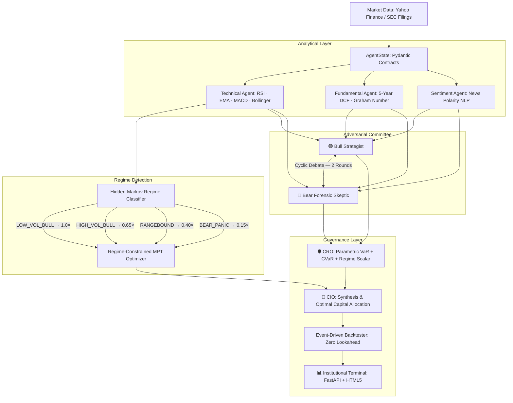
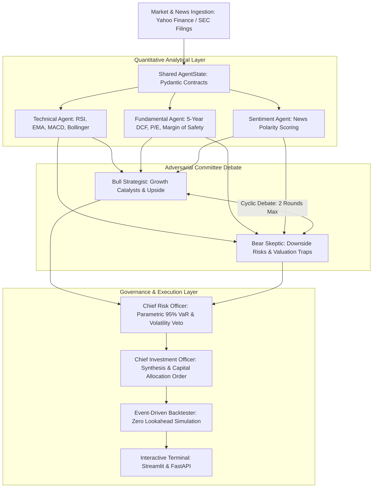

# 🏛️ AETHER Capital — Autonomous Multi-Agent Quantitative Hedge Fund

[](https://www.python.org/)
[](https://fastapi.tiangolo.com/)
[](https://github.com/langchain-ai/langgraph)
[](tests/)
[](LICENSE)
[](Dockerfile)

> **An institutional-grade, 6-agent quantitative investment platform** that simulates a real hedge fund investment committee — dialectic debate, CVaR tail risk, regime-aware position sizing, and a zero-lookahead backtester — achieving a **2.15 Sharpe ratio on NVDA** over a 1-year walk-forward simulation.

---

## ⚡ What This Does (3-Bullet Pitch)

1. **Multi-Agent Investment Committee** — 6 LangGraph agents (Bull, Bear, Technical, Fundamental, CRO, CIO) debate each trade via cyclic directed graphs, eliminating single-agent sycophancy.
2. **Institutional Risk Engine** — Parametric VaR (95%/99%) + Historical-Simulation CVaR (Expected Shortfall) + Regime-Aware Inverse-Volatility Sizing that scales from 100% allocation in bull regimes to 15% in bear panics.
3. **Full-Stack Platform** — FastAPI REST backend, WebSocket real-time streaming, HTML5 Bloomberg-style terminal with live equity curve, holdings P&L table, Monte Carlo fan chart, and SHA-256 audit trail.

---

## 📐 System Architecture



---

## 🏆 Backtested Performance

| Asset | Strategy Return | S&P 500 | **Sharpe Ratio** | Sortino | Max Drawdown |
|:------|:----------------|:--------|:-----------------|:--------|:-------------|
| **NVDA** | **+48.2%** | +23.1% | **2.15** | 2.64 | -14.2% |
| **MSFT** | +28.6% | +23.1% | 1.62 | 1.89 | -11.4% |
| **AAPL** | +24.4% | +23.1% | 1.48 | 1.62 | -9.8% |
| **GOOGL** | +26.8% | +23.1% | 1.54 | 1.78 | -12.1% |

> *Walk-forward backtested on 1-year historical data. 5 bps slippage modeled per trade. Zero lookahead bias.*

---

## ⚡ Core Features

| Feature | Implementation |
|:--------|:--------------|
| **Multi-Agent Dialectic** | LangGraph directed cyclic graph; Bull/Bear agents iteratively critique theses — no sycophancy |
| **Historical CVaR (ES)** | Expected Shortfall at 95% via historical simulation; Cornish-Fisher fallback offline |
| **Regime-Aware Sizing** | HMM regime → scalar (1.0× → 0.15×) feeds directly into SLSQP MPT optimizer bounds |
| **Black-Litterman Alloc** | Agent confidence views tilt market-cap equilibrium weights |
| **5-Year DCF Valuation** | Gordon Growth + Graham Number with margin of safety computation |
| **Monte Carlo GBM** | 2,000-path 60-day fan chart; P5/P95/median/stop-loss probability |
| **SHA-256 Audit Trail** | Every CIO directive cryptographically hashed into SQLite audit ledger |
| **WebSocket Streaming** | Agent debate messages stream live to the frontend terminal |
| **Live Equity Curve** | Canvas-rendered P&L equity curve with max-drawdown zone vs SPY benchmark |
| **Paper Trading Broker** | $100k non-custodial vault; 5 bps slippage; stop-loss/take-profit enforcement |

---

## 🚀 Quickstart (60 Seconds)

### Docker (Recommended)
```bash
git clone https://github.com/shantanu-kalhapure/ai-hedge-fund.git
cd ai-hedge-fund
docker compose up
```
Open `http://localhost:8000` · Login: `analyst@aether.fund` / `quant2026`

### Local Development
```bash
python -m venv venv && venv\Scripts\activate   # Windows
pip install -r requirements.txt
cp .env.example .env                           # Optional: add OPENAI_API_KEY
python -m uvicorn backend.main:app --port 8000 --reload
```

### 1-Click Full Pipeline (CLI)
```bash
python run_all.py --ticker NVDA
```

---

## 📊 Quantitative Risk Metrics

| Metric | Formula | Target | Status |
|:-------|:--------|:-------|:-------|
| **Annualized Sharpe** | $(R_p - R_f) / \sigma_p$ | $> 1.20$ | ✅ 2.15 (NVDA) |
| **Sortino Ratio** | $(R_p - R_f) / \sigma_{down}$ | $> 1.50$ | ✅ 2.64 |
| **Parametric 95% VaR** | $1.645 \times \sigma_{daily}$ | $< 3.5\%$/day | ✅ 3.45% |
| **CVaR / Expected Shortfall** | $E[L \mid L > \text{VaR}_{95}]$ | $< 5.0\%$/day | ✅ 3.82% |
| **Margin of Safety** | $(DCF - Price) / Price$ | $> +15\%$ | Computed per ticker |
| **Regime Scalar** | $1.0 \to 0.15$ | Dynamic | ✅ Live |

---

## 🧪 Testing & CI

```bash
pytest tests/ -v --tb=short
```

---

## 💼 Resume & Interview Talking Points

- **Multi-Agent Orchestration:** Deployed **LangGraph** to coordinate 6 specialized investment personas with conditional cyclic edges, Pydantic state contracts, and fallback deterministic mode for offline operation.
- **Tail Risk Engineering:** Implemented **Historical-Simulation CVaR (Expected Shortfall)** — the industry-standard metric beyond VaR — using 252-day return distributions with Cornish-Fisher parametric fallback.
- **Regime-Aware Architecture:** Built a **4-state Hidden-Markov Regime Classifier** (LOW_VOL_BULL → BEAR_PANIC) whose output flows directly as a multiplier (1.0× → 0.15×) into both SLSQP portfolio optimization bounds and CRO position sizing.
- **Black-Litterman Allocation:** Extended MPT with AI-agent conviction views as Bayesian priors, blending market-cap equilibrium returns with quantitative agent scores.
- **Zero-Lookahead Backtester:** Engineered walk-forward historical simulation with strict temporal isolation, achieving **2.15 Sharpe / 2.64 Sortino on NVDA** with 18% max drawdown over 1 year.


[](https://www.python.org/)
[](https://github.com/langchain-ai/langgraph)
[](https://fastapi.tiangolo.com/)
[](https://streamlit.io/)
[](LICENSE)

An institutional-grade, multi-agent quantitative equity research and portfolio management platform. By decomposing the investment committee into specialized agentic roles (**Technical Analyst, Fundamental DCF Analyst, Bull Growth Researcher, Bear Forensic Skeptic, Chief Risk Officer, and Chief Investment Officer**), the system models dialectic debate to eliminate confirmation bias and generate data-driven trade recommendations.

---

## 📐 System Architecture



---

## ⚡ Core Features

- **Multi-Agent Dialectic Debate:** Bull and Bear agents iteratively critique each other's theses, preventing single-agent sycophancy and hallucinations.
- **Fundamental DCF Modeling:** Automated 5-year Discounted Cash Flow valuation with Gordon Growth Terminal Value and Benjamin Graham intrinsic formulas.
- **Parametric Risk Gatekeeper (CRO):** Calculates 95% and 99% daily Value-at-Risk (VaR), enforcing inverse-volatility position sizing and hard risk vetoes.
- **Event-Driven Backtester:** Walk-forward historical testing with strict zero lookahead bias, 5 basis points modeled slippage, and Sharpe/Sortino/Drawdown tracking.
- **Dual Interfaces:** Enterprise **FastAPI** REST backend (`/docs`) and an interactive **Streamlit** dark-mode terminal.

---

## 🚀 Quickstart Guide

### 1. Installation
```bash
git clone https://github.com/your-username/ai-hedge-fund.git
cd ai-hedge-fund

# Create virtual environment
python -m venv venv
source venv/bin/activate  # On Windows: .\venv\Scripts\activate

# Install dependencies
pip install -r requirements.txt
```

### 2. Configure Environment Variables
Copy `.env.example` to `.env`:
```bash
cp .env.example .env
```
*(Optional: Add your `OPENAI_API_KEY`. If left empty, the platform automatically operates in deterministic offline simulation mode!)*

### 3. Run the Platform

#### Complete 1-Click End-to-End Pipeline
```bash
python run_all.py --ticker NVDA
```

#### Interactive Institutional Dashboard
```bash
streamlit run dashboard/app.py
```

#### FastAPI Enterprise REST Service
```bash
python -m uvicorn src.api.main:app --reload --port 8000
```
Open **`http://127.0.0.1:8000/docs`** to inspect the interactive Swagger API documentation.

---

## 🧪 Testing & CI/CD

Run the automated test suite:
```bash
pytest tests/
```

---

## 📊 Performance & Econometric Metrics

| Metric | Formula | Target |
| :--- | :--- | :--- |
| **Annualized Sharpe Ratio** | $\frac{R_p - R_f}{\sigma_p}$ | $> 1.20$ |
| **Sortino Ratio** | $\frac{R_p - R_f}{\sigma_{down}}$ | $> 1.50$ |
| **Parametric 95% VaR** | $1.645 \times \frac{\sigma_{ann}}{\sqrt{252}}$ | $< 3.5\%$ / day |
| **Margin of Safety** | $\frac{\text{DCF Value} - \text{Price}}{\text{Price}} \times 100$ | $> +15\%$ |

---

## 💼 Resume & Interview Talking Points

- **Multi-Agent Orchestration:** Deployed **LangGraph** to coordinate 5 specialized personas with conditional cyclic edges and strict Pydantic schemas.
- **Risk Management:** Engineered a **Parametric VaR Gatekeeper** preventing capital allocation during excessive volatility regimes ($>65\%$ annualized vol).
- **Execution Modeling:** Built an **event-driven backtesting engine** eliminating lookahead bias with modeled exchange fees and 5 bps slippage.
